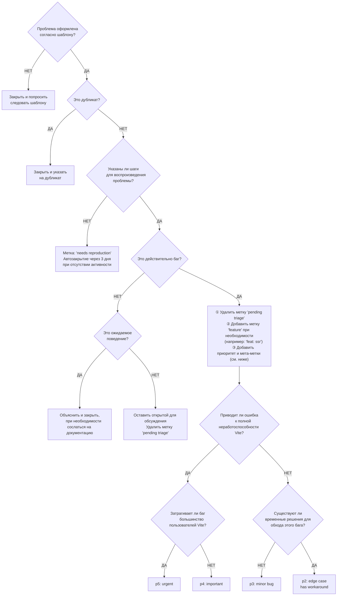
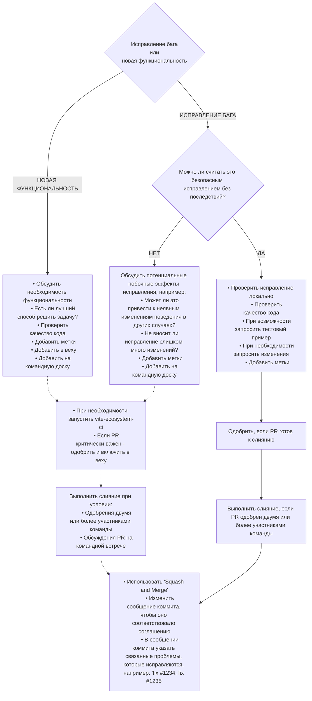

# Руководство по участию в Vite

Привет! Мы очень рады, что вы хотите внести свой вклад в Vite! Прежде чем отправить свой вклад, пожалуйста, прочтите следующее руководство. Мы также предлагаем вам прочитать [Философию проекта](https://vitejs.dev/guide/philosophy) в нашей документации.

Вы можете использовать [StackBlitz Codeflow](https://stackblitz.com/codeflow) для исправления ошибок или реализации функций. Вы увидите кнопку Codeflow в задачах, чтобы отправить пулреквест для исправления. На пулреквестах также появится кнопка, позволяющая просмотреть их без необходимости посещать ветку локально. При использовании Codeflow репозиторий Vite будет клонирован для вас в онлайн-редакторе, с пакетом Vite, собранным в режиме наблюдения, готовым для тестирования ваших изменений. Если вы хотите узнать больше, ознакомьтесь с [документацией Codeflow](https://developer.stackblitz.com/codeflow/what-is-codeflow).

[](https://pr.new/vitejs/vite)

## Настройка репозитория

Для локальной разработки создайте форк репозитория Vite и клонируйте его на свой локальный компьютер. Репозиторий Vite — это монорепозиторий, использующий рабочие пространства pnpm. Менеджером пакетов, используемым для установки и связывания зависимостей, должен быть [pnpm](https://pnpm.io/). Вы можете найти требуемую версию pnpm в файле `package.json` по ключу `packageManager`.

Чтобы разработать и протестировать основной пакет `vite`:

1. Запустите `pnpm i` в корневой папке Vite.

2. Запустите `pnpm run build` в корневой папке Vite.

3. Если вы разрабатываете сам Vite, вы можете перейти в `packages/vite` и запустить `pnpm run dev`, чтобы автоматически пересобирать Vite всякий раз, когда вы меняете его код.

Альтернативно вы можете использовать [Vite.js Docker Dev](https://github.com/nystudio107/vitejs-docker-dev) для контейнерной настройки Docker для разработки Vite.js.

> Если вы работаете с несколькими проектами, использующими разные версии pnpm, рекомендуется включить [Corepack](https://github.com/nodejs/corepack), выполнив команду `corepack enable`.

### Игнорирование коммитов при запуске `git blame`

У нас есть файл `.git-blame-ignore-revs`, чтобы игнорировать изменения форматирования.
Чтобы этот файл использовался `git blame`, вам нужно выполнить следующую команду.

```sh
git config --local blame.ignoreRevsFile .git-blame-ignore-revs
```

## Отладка

Чтобы использовать точки останова и исследовать выполнение кода, вы можете применять функцию [«Запуск и отладка»](https://code.visualstudio.com/docs/editor/debugging) из VS Code:

1. Добавьте оператор `debugger` в том месте, где вы хотите остановить выполнение кода.

2. Щёлкните значок «Запуск и отладка» на панели действий редактора. Откроется окно [_Запуск и отладка_](https://code.visualstudio.com/docs/editor/debugging#_run-and-debug-view).

3. Нажмите кнопку «Терминал отладки JavaScript» в окне _Запуск и отладка_, чтобы открыть терминал в VS Code.

4. Из этого терминала перейдите в `playground/xxx` и запустите `pnpm run dev`.

5. Выполнение остановится на операторе `debugger`, и вы можете использовать [панель инструментов отладки](https://code.visualstudio.com/docs/editor/debugging#_debug-actions) для продолжения, перехода и перезапуска процесса...

### Отладка ошибок в тестах Vitest с помощью Playwright (Chromium)

Некоторые ошибки маскируются и скрываются благодаря слоям абстракции и «песочнице», добавляемым Vitest, Playwright и Chromium. Чтобы увидеть, что на самом деле происходит не так, и содержимое консоли инструментов разработчика в этих случаях, выполните следующие действия:

1. Добавьте оператор `debugger` в хук `playground/vitestSetup.ts` -> `afterAll`. Это приостановит выполнение до завершения тестов и выхода экземпляра браузера Playwright.

2. Запустите тесты с помощью команды скрипта `debug-serve`, которая включит удалённую отладку: `pnpm run debug-serve resolve`.

3. Дождитесь, пока инспектор инструментов разработчика откроется в браузере, а отладчик подключится.

4. На панели источников в правой колонке нажмите кнопку воспроизведения, чтобы возобновить выполнение, и разрешите тестам запуститься, в результате чего откроется экземпляр Chromium.

5. Сфокусировавшись на экземпляре Chromium, вы можете открыть инструменты разработчика браузера и просмотреть консоль, чтобы найти основные проблемы.

6. Чтобы закрыть всё, просто остановите процесс тестирования в терминале.

## Тестирование Vite с внешними пакетами

Возможно, вы захотите протестировать свою локально изменённую копию Vite с другим пакетом, собранным вместе с Vite. Для pnpm, после сборки Vite, вы можете использовать [`pnpm.overrides`](https://pnpm.io/package_json#pnpmoverrides), чтобы сделать это. Обратите внимание, что `pnpm.overrides` должен быть указан в корневом `package.json`, и вы должны указать пакет как зависимость в корневом `package.json`:

```json
{
  "dependencies": {
    "vite": "^6.0.0"
  },
  "pnpm": {
    "overrides": {
      "vite": "link:../path/to/vite/packages/vite"
    }
  }
}
```

И повторно запустите `pnpm install`, чтобы связать пакет.

## Выполнение тестов

### Интеграционные тесты

Каждый пакет под `playground/` содержит директорию `__tests__`. Тесты выполняются с помощью [Vitest](https://vitest.dev/) + [Playwright](https://playwright.dev/) с пользовательскими интеграциями для упрощения написания тестов. Детальная настройка находится в файлах `vitest.config.e2e.js` и `playground/vitest*`.

Некоторые игровые площадки определяют варианты запуска одного и того же приложения с использованием различных настроек конфигурации. По условию, при запуске тестового файла во вложенной папке в `__tests__`, установка попытается использовать файл конфигурации с именем `vite.config-{folderName}.js` в корне игровой площадки. Пример вариантов можно увидеть в [песочнице ресурсов](https://github.com/vitejs/vite/tree/main/playground/assets).

Перед запуском тестов убедитесь, что [Vite был собран](#repo-setup). В Windows вам может понадобиться [активировать режим разработчика](https://docs.microsoft.com/en-us/windows/apps/get-started/enable-your-device-for-development), чтобы решить [проблемы с созданием симлинков для неадминистраторов](https://github.com/vitejs/vite/issues/7390). Также вам может понадобиться [установить в git `core.symlinks` значение `true`, чтобы решить проблемы с симлинками в git](https://github.com/vitejs/vite/issues/5242).

Каждый интеграционный тест может быть запущен как в режиме dev-сервера, так и в режиме сборки.

- `pnpm test` по умолчанию запускает все интеграционные тесты как в режиме обслуживания, так и в режиме сборки, а также юнит-тесты.

- `pnpm run test-serve` запускает тесты только в режиме обслуживания.

- `pnpm run test-build` запускает тесты только в режиме сборки.

- `pnpm run test-serve [match]` или `pnpm run test-build [match]` запускает тесты в определённых пакетах, которые соответствуют заданному фильтру. Например, `pnpm run test-serve asset` запускает тесты для `playground/asset` и `vite/src/node/__tests__/asset` в режиме обслуживания.

  Обратите внимание, что сопоставление пакетов недоступно для скрипта `pnpm test`, который всегда запускает все тесты.

### Модульные тесты

Кроме тестов в каталоге `playground/` для интеграционных тестов, пакеты могут содержать модульные тесты в каталоге `__tests__`. Юнит-тесты выполняются с помощью [Vitest](https://vitest.dev/). Подробный конфиг находится в файлах `vitest.config.ts`.

- `pnpm run test-unit` запускает юнит-тесты для каждого пакета.

- `pnpm run test-unit [match]` запускает тесты в определённых пакетах, которые соответствуют заданному фильтру.

### Тестирование переменных окружения и хелперов

Внутри тестов игровой площадки вы можете импортировать объект `page` из `~utils`, который представляет собой экземпляр Playwright [`Page`](https://playwright.dev/docs/api/class-page), уже перешедший на обслуживаемую страницу текущей игровой площадки. Итак, написать тест очень просто:

```js
import { page } from '~utils'

test('should work', async () => {
  expect(await page.textContent('.foo')).toMatch('foo')
})
```

Некоторые распространённые хелперы тестирования (например: `testDir`, `isBuild` или `editFile`) также доступны в утилитах. Исходный код находится по адресу `playground/test-utils.ts`.

Примечание: Среда сборки тестов использует [другой набор конфигурации Vite по умолчанию](https://github.com/vitejs/vite/blob/main/playground/vitestSetup.ts#L102-L122) для пропуска транспиляции во время тестов, чтобы сделать их быстрее. Это может привести к другому результату по сравнению со стандартной производственной сборкой.

### Расширение набора тестов

Чтобы добавить новые тесты, нужно найти связанную с исправлением или функцией игровую площадку (или создать новую). Например, загрузка статических активов тестируется в [песочнице ресурсов](https://github.com/vitejs/vite/tree/main/playground/assets). В этом приложении Vite есть тест на импорт `?raw` с [определённым для него разделом в `index.html`](https://github.com/vitejs/vite/blob/main/playground/assets/index.html#L121):

```html
<h2>?raw import</h2>
<code class="raw"></code>
```

Он будет изменён [в результате импорта файла](https://github.com/vitejs/vite/blob/main/playground/assets/index.html#L151):

```js
import rawSvg from './nested/fragment.svg?raw'
text('.raw', rawSvg)
```

...где функция `text` определяется как:

```js
function text(el, text) {
  document.querySelector(el).textContent = text
}
```

В [специальных тестах](https://github.com/vitejs/vite/blob/main/playground/assets/__tests__/assets.spec.ts#L180) для проверки этой возможности используются модификации DOM, перечисленные выше:

```js
test('?raw import', async () => {
  expect(await page.textContent('.raw')).toMatch('SVG')
})
```

## Примечание о тестовых зависимостях

Во многих тестовых случаях нам нужно подделать зависимости, используя протоколы `link:` и `file:`. `pnpm` рассматривает `link:` как симлинки, а `file:` как хардлинки. Для проверки зависимостей, как если бы они были скопированы в `node_modules`, используйте протокол `file:`. В противном случае используйте протокол `link:`.

Для имитации зависимости обязательно добавьте префикс `@vitejs/test-` к имени пакета. Это позволит избежать возможных проблем, таких как ложноположительные оповещения.

## Ведение журнала отладки

Вы можете установить переменную окружения `DEBUG`, чтобы включить отладочные журналы (например: `DEBUG="vite:resolve"`). Чтобы увидеть все журналы отладки, можно установить `DEBUG="vite:*"`, но учтите, что записей будет очень много. Используйте команду `grep -r "createDebugger('vite:" packages/vite/src/`, чтобы увидеть список доступных областей отладки.

## Руководство по составлению запросов

- Создайте ветку темы от базовой ветки (например, `main`) и объедините изменения обратно с этой веткой.

- При добавлении новой функции:

  - Добавьте сопутствующий тестовый пример.
  - Приведите убедительные доводы в пользу добавления этой функции. В идеале сначала нужно открыть вопрос с предложением и получить его одобрение, прежде чем работать над ним.

- При исправлении ошибки:

  - Если вы решаете особую проблему, добавьте `(fix #xxxx[,#xxxx])` (где #xxxx — идентификатор проблемы) в заголовок вашего запроса на сообщение, чтобы улучшить журнал релиза (например, `fix: update entities encoding/decoding (fix #3899)`).
  - Предоставьте подробное описание ошибки в PR. Предпочтительна живая демо-версия.
  - Если применимо, добавьте соответствующее тестовое покрытие.

- В процессе работы над PR можно сделать несколько небольших коммитов. GitHub может автоматически объединить их перед слиянием.

- Убедитесь, что все тесты пройдены!

- Не нужно беспокоиться о стиле кода, если вы установили dev-зависимости. Изменённые файлы автоматически форматируются с помощью Prettier при фиксации (путём вызова [Git Hooks](https://git-scm.com/docs/githooks) через [simple-git-hooks](https://github.com/toplenboren/simple-git-hooks)).

- Заголовок PR должен соответствовать [конвенции сообщений о фиксации](./.github/commit-convention.md), чтобы журналы изменений могли быть сгенерированы автоматически.

## Руководство по сопровождению кода

> Следующий раздел в основном предназначен для сопровождающих, у которых есть доступ к фиксации, но его полезно пройти, если вы собираетесь внести нетривиальный вклад в базу кода.

### Рабочий процесс сортировки проблем



### Рабочий процесс рассмотрения запросов на публикацию



## Примечания о зависимостях

Vite стремится быть легковесным, и это включает в себя осведомленность о количестве зависимостей npm и их размере.

Мы используем Rollup для предварительной сборки большинства зависимостей перед публикацией! Поэтому большинство зависимостей, даже те, которые используются в исходном коде во время выполнения, по умолчанию должны быть добавлены в `devDependencies`. Это также создает следующие ограничения, о которых мы должны знать в кодовой базе.

### Использование `require()`

В некоторых случаях мы намеренно ленимся требовать некоторые зависимости, чтобы повысить производительность запуска. Однако обратите внимание, что мы не можем использовать простые вызовы `require('somedep')`, поскольку они игнорируются в ESM-файлах, поэтому зависимость не будет включена в сборку, а фактическая зависимость даже не появится при публикации, поскольку она находится в `devDependencies`.

Вместо этого используйте `(await import('somedep')).default`.

### Подумайте, прежде чем добавлять зависимость

Большинство зависимостей должны быть добавлены в `devDependencies`, даже если они необходимы во время выполнения. Исключения составляют:

- Пакеты типов. Пример: `@types/*`.
- Зависимости, которые не могут быть правильно скомпонованы из-за бинарных файлов. Пример: `esbuild`.
- Зависимости, поставляющие свои собственные типы, которые используются в собственных публичных типах Vite. Пример: `rollup`.

Избегайте пакетов с большими транзитивными зависимостями, которые приводят к раздуванию размера по сравнению с функциональностью, которую они предоставляют. Например, размер самого `http-proxy` плюс `@types/http-proxy` составляет чуть больше 1 МБ, но `http-proxy-middleware` тянет за собой тонну зависимостей, которые превращают его в 7 МБ(!), в то время как минимальный пользовательский middleware поверх `http-proxy` требует всего пару строк кода.

### Обеспечьте поддержку типов

Vite стремится быть полностью пригодным для использования в качестве зависимого компонента в TypeScript-проекте (например, он должен обеспечить правильную типизацию для VitePress), а также в `vite.config.ts`. Это означает, что технически зависимость, типы которой раскрываются, должна быть частью `dependencies`, а не `devDependencies`. Однако это также означает, что мы не сможем её упаковать.

Чтобы обойти это, мы инлайним некоторые типы этих зависимостей в `packages/vite/src/types`. Таким образом, мы всё ещё можем раскрывать типизацию, но при этом связывать исходный код зависимости.

Используйте `pnpm run build-types-check`, чтобы проверить, что поставляемые типы не зависят от типов в `devDependencies`.

Для типов, общих для клиента и узла, они должны быть добавлены в `packages/vite/types`. Эти типы не комплектуются и публикуются как есть (хотя они по-прежнему считаются внутренними). Типы зависимостей в этом каталоге (например, `packages/vite/types/chokidar.d.ts`) устарели и должны быть добавлены в `packages/vite/src/types`.

### Подумайте, прежде чем добавлять ещё одну опцию

У нас уже есть множество опций конфигурации, и мы не должны исправлять проблему, добавляя ещё одну. Прежде чем добавить опцию, подумайте:

- Действительно ли проблема стоит решения?
- Можно ли решить её более умным значением по умолчанию?
- Есть ли обходное решение с использованием существующих опций?
- Можно ли решить проблему с помощью плагина?

## Релиз

Если у вас есть права на публикацию, ниже описаны шаги для выпуска новой версии пакета. Процесс состоит из двух этапов: **Релиз** и **Публикация**.

**Релиз** выполняется локально для генерации журнала изменений и git-тегов:

1. Убедитесь, что удалённый репозиторий `origin` ссылается на `https://github.com/vitejs/vite`.
2. В корне проекта `vite` (ветка `main`) выполните `git pull` и `pnpm i`, чтобы обновить код. Затем запустите `pnpm build`.
3. Запустите `pnpm release` и следуйте инструкциям, чтобы создать релиз пакета. Скрипт сгенерирует журнал изменений, создаст git-тег и отправит изменения в `origin`. Можно запустить с флагом `--dry` для тестирования.
4. После завершения команды появится ссылка на `https://github.com/vitejs/vite/actions/workflows/publish.yml`.
5. Перейдите по ссылке и следуйте дальнейшим инструкциям.

**Публикация** выполняется через GitHub Actions для загрузки пакета в npm:

1. Вскоре на странице workflows появится новая задача для выпущенного пакета, ожидающая подтверждения публикации в npm.
2. Откройте страницу workflow.
3. Нажмите кнопку **Review deployments** в жёлтом блоке — появится всплывающее окно.
4. Отметьте **Release** и нажмите **Approve and deploy**.
5. Пакет начнёт публиковаться в npm.

## Вклад в перевод документации

Чтобы добавить новый язык в документацию Vite, смотрите [`vite-docs-template`](https://github.com/tony19/vite-docs-template/blob/main/.github/CONTRIBUTING.md).