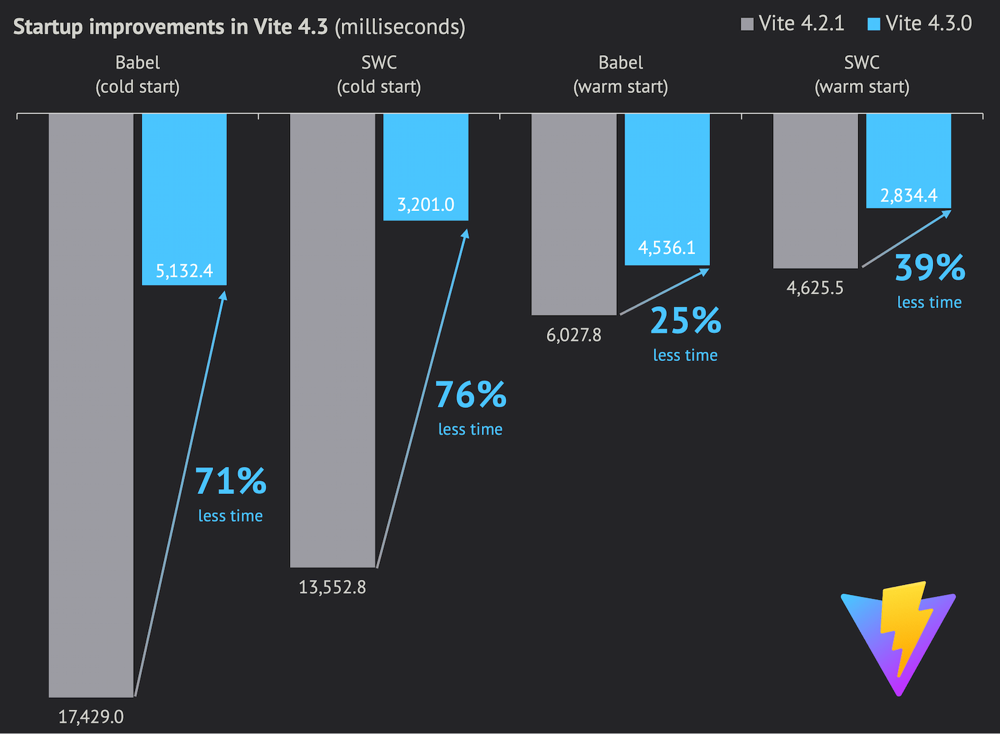
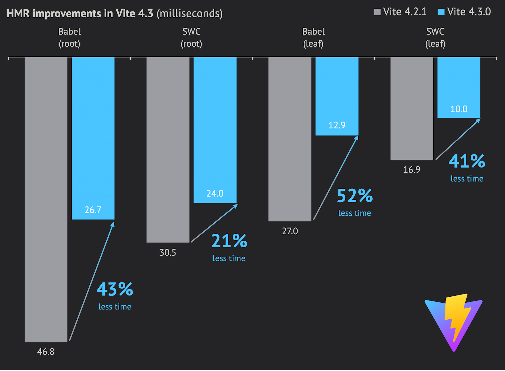

# Доступен Vite 4.3! {#vite-4-3-is-out}

_20 апреля 2023_

Быстрые ссылки:

- Документация: [English](/), [简体中文](https://cn.vite.dev/), [日本語](https://ja.vite.dev/), [Español](https://es.vite.dev/), [Português](https://pt.vite.dev/)
- [Журнал изменений Vite 4.3](https://github.com/vitejs/vite/blob/main/packages/vite/CHANGELOG.md#430-2023-04-20)

## Улучшения производительности {#performance-improvements}

В этом обновлении мы сосредоточились на улучшении производительности dev-сервера. Логика разрешения была оптимизирована, что улучшило горячие пути и реализовало более умное кэширование для поиска `package.json`, файлов конфигурации TS и разрешённых URL в целом.

Вы можете прочитать подробное описание выполненной работы по производительности в этом блоге одного из участников Vite: [Как мы сделали Vite 4.3 значительно быстрее 🚀](https://sun0day.github.io/blog/vite/why-vite4_3-is-faster.html).

Этот спринт привел к улучшению скорости во всех аспектах по сравнению с Vite 4.2.

Вот улучшения производительности, измеренные с помощью [sapphi-red/performance-compare](https://github.com/sapphi-red/performance-compare), который тестирует приложение с 1000 компонентами React, время холодного и теплого старта dev-сервера, а также время HMR для корневого и листового компонента (не содержащего других компонентов):

| **Vite (babel)**   |  Vite 4.2 | Vite 4.3 | Улучшение |
| :----------------- | --------: | -------: | ----------: |
| **dev cold start** | 17249.0мс | 5132.4мс |      -70.2% |
| **dev warm start** |  6027.8мс | 4536.1мс |      -24.7% |
| **Root HMR**       |    46.8мс |   26.7мс |      -42.9% |
| **Leaf HMR**       |    27.0мс |   12.9мс |      -52.2% |

| **Vite (swc)**     |  Vite 4.2 | Vite 4.3 | Улучшение |
| :----------------- | --------: | -------: | ----------: |
| **dev cold start** | 13552.5мс | 3201.0мс |      -76.4% |
| **dev warm start** |  4625.5мс | 2834.4мс |      -38.7% |
| **Root HMR**       |    30.5мс |   24.0мс |      -21.3% |
| **Leaf HMR**       |    16.9мс |   10.0мс |      -40.8% |

Вы можете прочитать больше информации о бенчмарке [здесь](https://gist.github.com/sapphi-red/25be97327ee64a3c1dce793444afdf6e). Спецификации и версии для этого теста производительности:

- Процессор: Ryzen 9 5900X, Оперативная память: DDR4-3600 32GB, SSD: WD Blue SN550 NVME SSD
- Windows 10 Pro 21H2 19044.2846
- Версии Node.js: 18.16.0
- Версии Vite и плагинов React
  - Vite 4.2 (babel): Vite 4.2.1 + plugin-react 3.1.0
  - Vite 4.3 (babel): Vite 4.3.0 + plugin-react 4.0.0-beta.1
  - Vite 4.2 (swc): Vite 4.2.1 + plugin-react-swc 3.2.0
  - Vite 4.3 (swc): Vite 4.3.0 + plugin-react-swc 3.3.0

Ранние пользователи также сообщали о 1.5x-2x улучшении времени старта разработки на реальных приложениях при тестировании бета-версии Vite 4.3. Нам было бы интересно узнать результаты для ваших приложений.

## Профилирование {#profiling}

Мы продолжим работать над производительностью Vite. Мы разрабатываем официальный [инструмент бенчмаркинга](https://github.com/vitejs/vite-benchmark) для Vite, который позволит нам получать метрики производительности для каждого пулреквеста.

Также [vite-plugin-inspect](https://github.com/antfu/vite-plugin-inspect) теперь имеет больше функций, связанных с производительностью, чтобы помочь вам определить, какие плагины или мидлвары являются узким местом для ваших приложений.

Используя `vite --profile` (а затем нажав `p`) после загрузки страницы, вы сможете сохранить профиль ЦП для запуска dev-сервера. Вы можете открыть его в приложении, таком как [speedscope](https://www.speedscope.app/), чтобы выявить проблемы с производительностью. Вы можете поделиться своими находками с командой Vite в [Обсуждении](https://github.com/vitejs/vite/discussions) или в [Discord Vite](https://chat.vite.dev).

## Следующие шаги {#next-steps}

Мы решили выпустить одну основную версию Vite в этом году, синхронизировав её с [концом поддержки Node.js 16](https://endoflife.date/nodejs) в сентябре, и прекратить поддержку как Node.js 14, так и 16. Если вы хотите участвовать, мы начали [Обсуждение Vite 5](https://github.com/vitejs/vite/discussions/12466), чтобы собрать ранние отзывы.
