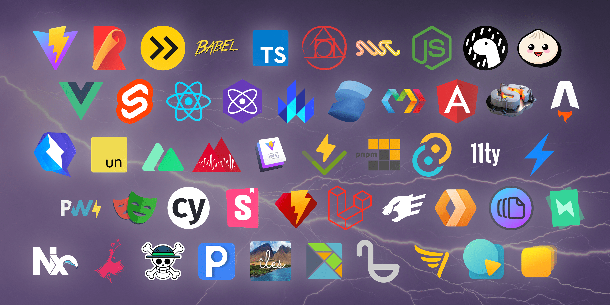

# Доступен Vite 4.0! {#vite-4-0-is-out}

_9 декабря 2022_ - посмотрите [анонс Vite 5.0](./announcing-vite5.md)

Vite 3 [был выпущен](./announcing-vite3.md) пять месяцев назад. С тех пор количество загрузок пакета npm в неделю увеличилось с 1 миллиона до 2.5 миллионов. Экосистема также созрела и продолжает расти. В этом году в [опросе Jamstack Conf](https://twitter.com/vite_js/status/1589665610119585793) использование среди сообщества выросло с 14% до 32%, при этом сохранив высокий уровень удовлетворенности 9.7. Мы увидели стабильные релизы [Astro 1.0](https://astro.build/), [Nuxt 3](https://v3.nuxtjs.org/) и других фреймворков на базе Vite, которые внедряют инновации и сотрудничают: [SvelteKit](https://kit.svelte.dev/), [Solid Start](https://www.solidjs.com/blog/introducing-solidstart), [Qwik City](https://qwik.builder.io/qwikcity/overview/). Storybook объявил о поддержке Vite в качестве одной из основных функций для [Storybook 7.0](https://storybook.js.org/blog/first-class-vite-support-in-storybook/). Deno теперь [поддерживает Vite](https://www.youtube.com/watch?v=Zjojo9wdvmY). Принятие [Vitest](https://vitest.dev) стремительно растет, и вскоре он будет представлять половину загрузок Vite в npm. Nx также инвестирует в экосистему и [официально поддерживает Vite](https://nx.dev/packages/vite).

[](https://viteconf.org/2022/replay)

В качестве демонстрации роста, который испытали Vite и связанные с ним проекты, экосистема Vite собралась 11 октября на [ViteConf 2022](https://viteconf.org/2022/replay). Мы увидели представителей основных веб-фреймворков и инструментов, рассказывающих истории об инновациях и сотрудничестве. И в символическом шаге команда Rollup выбрала именно этот день для выпуска [Rollup 3](https://rollupjs.org).

Сегодня [команда Vite](/team) с помощью наших партнёров по экосистеме рада объявить о выпуске Vite 4, который в процессе сборки использует Rollup 3. Мы работали с экосистемой, чтобы обеспечить плавный путь обновления для этой новой мажорной версии. Vite теперь использует [Rollup 3](https://github.com/vitejs/vite/issues/9870), что позволило нам упростить внутреннюю обработку ресурсов Vite и получить множество улучшений. Смотрите [заметки о выпуске Rollup 3 здесь](https://github.com/rollup/rollup/releases/tag/v3.0.0).


Быстрые ссылки:

- [Документация](/)
- [Руководство по переходу](https://v4.vite.dev/guide/migration.html)
- [Журнал изменений](https://github.com/vitejs/vite/blob/main/packages/vite/CHANGELOG.md#400-2022-12-09)

Документация на других языках:

- [English](https://vite.dev/)
- [简体中文](https://cn.vite.dev/)
- [日本語](https://ja.vite.dev/)
- [Español](https://es.vite.dev/)

Если вы недавно начали использовать Vite, мы рекомендуем прочитать следующие разделы руководства: [Почему Vite](/guide/why.html), [Начало работы](/guide/) и [Возможности](/guide/features). Если вы хотите участвовать, мы будем рады вашим вкладам на [GitHub](https://github.com/vitejs/vite). Почти [700 человек](https://github.com/vitejs/vite/graphs/contributors) уже внесли свой вклад в Vite. Следите за обновлениями в [Twitter](https://twitter.com/vite_js) и [Mastodon](https://webtoo.ls/@vite), или сотрудничайте с другими в нашем [сообществе Discord](https://chat.vite.dev/).

## Поэкспериментируйте с Vite 4 {#start-playing-with-vite-4}

Используйте `pnpm create vite`, чтобы создать проект Vite с предпочитаемым фреймворком, или откройте готовый онлайн-шаблон, чтобы поиграть с Vite 4, используя [vite.new](https://vite.new).

Вы также можете запустить `pnpm create vite-extra`, чтобы получить доступ к шаблонам от других фреймворков и сред выполнения (Solid, Deno, SSR и стартеры библиотек). Шаблоны `create vite-extra` также доступны, когда вы запускаете `create vite` в разделе `Others`.

Обратите внимание, что шаблоны для старта Vite предназначены для использования в качестве площадки для тестирования Vite с различными фреймворками. При создании вашего следующего проекта мы рекомендуем обратиться к стартерам, рекомендованным каждым фреймворком. Некоторые фреймворки теперь перенаправляют в `create vite` на свои стартеры тоже (`create-vue` и `Nuxt 3` для Vue, и `SvelteKit` для Svelte).

## Новый плагин для React с использованием SWC в процессе разработки {#new-react-plugin-using-swc-during-development}

[SWC](https://swc.rs/) теперь является зрелой заменой [Babel](https://babeljs.io/), особенно в контексте проектов на React. Реализация React Fast Refresh в SWC значительно быстрее, чем в Babel, и для некоторых проектов это теперь лучшая альтернатива. С Vite 4 доступны два плагина для проектов на React с различными компромиссами. Мы считаем, что оба подхода заслуживают поддержки на данном этапе, и будем продолжать исследовать улучшения для обоих плагинов в будущем.

### @vitejs/plugin-react

[@vitejs/plugin-react](https://github.com/vitejs/vite-plugin-react) — это плагин, который использует esbuild и Babel, обеспечивая быструю замену модулей (HMR) с небольшим размером пакета и гибкостью использования конвейерного преобразования Babel.

### @vitejs/plugin-react-swc (новинка) {#vitejs-plugin-react-swc-new}

[@vitejs/plugin-react-swc](https://github.com/vitejs/vite-plugin-react-swc) — это новый плагин, который использует esbuild во время сборки, но заменяет Babel на SWC в процессе разработки. Для крупных проектов, которые не требуют нестандартных расширений React, первоначальный запуск и горячая замена модулей (HMR) могут быть значительно быстрее.

## Совместимость с браузерами {#browser-compatibility}

Современная сборка для браузеров теперь по умолчанию нацелена на `safari14` для более широкой совместимости с ES2020. Это означает, что современные сборки теперь могут использовать [`BigInt`](https://developer.mozilla.org/ru/docs/Web/JavaScript/Reference/Global_Objects/BigInt), и оператор [nullish coalescing](https://developer.mozilla.org/ru/docs/Web/JavaScript/Reference/Operators/Nullish_coalescing) больше не транспилируется. Если вам нужно поддерживать старые браузеры, вы можете добавить [`@vitejs/plugin-legacy`](https://github.com/vitejs/vite/tree/main/packages/plugin-legacy) как обычно.

## Импорт CSS как строки {#importing-css-as-a-string}

В Vite 3 импортирование значения по умолчанию из файла `.css` могло привести к двойной загрузке CSS:

```ts
import cssString from './global.css'
```

Двойная загрузка могла происходить, поскольку файл `.css` будет сгенерирован, и, вероятно, строка CSS также будет использоваться кодом приложения — например, внедрена во время выполнения фреймворка. С Vite 4 экспорт по умолчанию для `.css` [был объявлен устаревшим](https://github.com/vitejs/vite/issues/11094). В этом случае необходимо использовать модификатор суффикса запроса `?inline`, так как он не генерирует импортированные стили `.css`:

```ts
import stuff from './global.css?inline'
```

Узнайте больше в [Руководстве по переходу](https://v4.vite.dev/guide/migration.html).

## Переменные окружения {#environment-variables}

Vite теперь использует `dotenv` версии 16 и `dotenv-expand` версии 9 (ранее использовались `dotenv` версии 14 и `dotenv-expand` версии 5). Если у вас есть значение, содержащее `#` или `` ` ``, вам нужно будет обернуть его в кавычки:

```diff
-VITE_APP=ab#cd`ef
+VITE_APP="ab#cd`ef"
```

Для получения более подробной информации смотрите [журнал изменений `dotenv`](https://github.com/motdotla/dotenv/blob/master/CHANGELOG.md) и [журнал изменений `dotenv-expand`](https://github.com/motdotla/dotenv-expand/blob/master/CHANGELOG.md).

## Другие функции {#other-features}

- Сокращения CLI (нажмите `h` во время разработки, чтобы увидеть все) ([#11228](https://github.com/vitejs/vite/pull/11228))
- Поддержка patch-package при предварительной сборке зависимостей ([#10286](https://github.com/vitejs/vite/issues/10286))
- Более чистый вывод журналов сборки ([#10895](https://github.com/vitejs/vite/issues/10895)) и переход на `kB` для согласования с инструментами разработчика браузера ([#10982](https://github.com/vitejs/vite/issues/10982))
- Улучшенные сообщения об ошибках во время SSR ([#11156](https://github.com/vitejs/vite/issues/11156))

## Уменьшение размера пакета {#reduced-package-size}

Vite заботится о своем размере, чтобы ускорить установку, особенно в случае использования в качестве площадок для документации и воспроизведений. И снова, эта мажорная версия приносит улучшения в размере пакета Vite. Размер установки Vite 4 на 23% меньше по сравнению с Vite 3.2.5 (14.1 МБ против 18.3 МБ).

## Обновления Vite Core {#upgrades-to-vite-core}

[Vite Core](https://github.com/vitejs/vite) и [vite-ecosystem-ci](https://github.com/vitejs/vite-ecosystem-ci) продолжают развиваться, чтобы обеспечить лучший опыт для разработчиков, а также чтобы гарантировать, что разработка Vite масштабируется в соответствии с ростом экосистемы.

### Плагины фреймворков вне ядра {#framework-plugins-out-of-core}

[`@vitejs/plugin-vue`](https://github.com/vitejs/vite-plugin-vue) и [`@vitejs/plugin-react`](https://github.com/vitejs/vite-plugin-react) были частью монорепозитория Vite Core с первых версий Vite. Это помогло нам получить обратную связь при внесении изменений, так как мы тестировали и выпускали как ядро, так и плагины вместе. С помощью [vite-ecosystem-ci](https://github.com/vitejs/vite-ecosystem-ci) мы можем получать эту обратную связь с этими плагинами, разрабатываемыми в независимых репозиториях, поэтому с Vite 4 [они были перемещены из монорепозитория Vite Core](https://github.com/vitejs/vite/pull/11158). Это имеет значение для истории Vite, не зависящей от фреймворков, и позволит нам создать независимые команды для поддержки каждого из плагинов. Если вы обнаружите какие-либо ошибки или захотите поделиться новыми функциями, пожалуйста, создайте соответствующие задачи в новых репозиториях: [`vitejs/vite-plugin-vue`](https://github.com/vitejs/vite-plugin-vue) и [`vitejs/vite-plugin-react`](https://github.com/vitejs/vite-plugin-react).

### Улучшения vite-ecosystem-ci {#vite-ecosystem-ci-improvements}

[vite-ecosystem-ci](https://github.com/vitejs/vite-ecosystem-ci) расширяет CI Vite, предоставляя отчёты о состоянии CI для [большинства основных зависящих от Vite проектов](https://github.com/vitejs/vite-ecosystem-ci/tree/main/tests) по запросу. Мы запускаем vite-ecosystem-ci три раза в неделю и получаем своевременные отчёты перед введением регрессии. Vite 4 вскоре будет совместим с большинством проектов, использующих Vite, которые уже подготовили ветки с необходимыми изменениями и выпустят их в ближайшие дни. Мы также можем запускать vite-ecosystem-ci по запросу через пулреквесты, используя `/ecosystem-ci run` в комментарии, что позволяет нам узнать [эффект изменений](https://github.com/vitejs/vite/pull/11269#issuecomment-1343365064) до их попадания в основную ветку.

## Благодарности {#acknowledgments}

Vite 4 не был бы возможен без бесчисленных часов работы участников Vite, многие из которых являются разработчиками проектов и плагинов, а также усилий [команды Vite](/team). Все мы работали вместе, чтобы ещё раз улучшить опыт разработчиков (DX) Vite для каждого фреймворка и приложения, использующего его. Мы благодарны за возможность улучшить общую базу для такой яркой экосистемы.

Мы также благодарны отдельным лицам и компаниям, спонсирующим команду Vite, а также компаниям, которые напрямую инвестируют в будущее Vite: работа [@antfu7](https://twitter.com/antfu7) над Vite и экосистемой является частью его работы в [Nuxt Labs](https://nuxtlabs.com/), [Astro](https://astro.build) финансирует работу [@bluwyoo](https://twitter.com/bluwyoo) над Vite Core, а [StackBlitz](https://stackblitz.com/) нанимает [@patak_dev](https://twitter.com/patak_dev) для работы над Vite на полную ставку.

## Следующие шаги {#next-steps}

Наше непосредственное внимание будет сосредоточено на сортировке вновь открытых задач, чтобы избежать сбоев из-за возможных регрессий. Если вы хотите участвовать и помочь нам улучшить Vite, мы рекомендуем начать с сортировки задач. Присоединяйтесь к [нашему Discord](https://chat.vite.dev) и обращайтесь в канале `#contributing`. Улучшайте нашу историю в `#docs` и помогайте другим в `#help`. Нам нужно продолжать строить полезное и дружелюбное сообщество для следующей волны пользователей, поскольку использование Vite продолжает расти.

Существует множество открытых направлений для дальнейшего улучшения опыта разработчиков (DX) для всех, кто выбрал Vite для поддержки своих фреймворков и разработки приложений. Вперёд!
