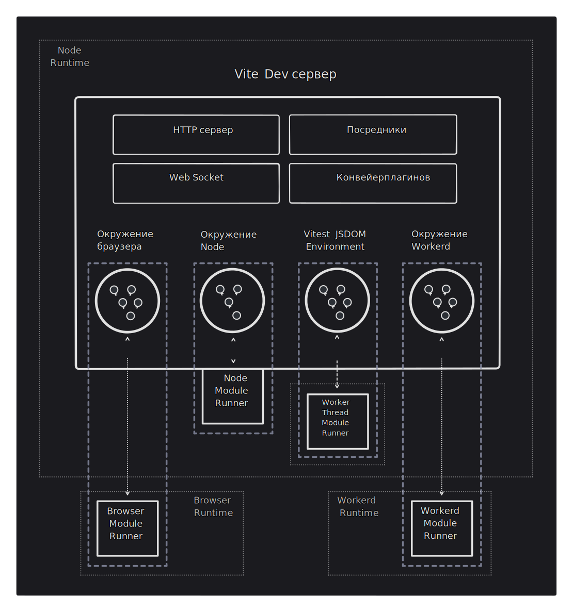

# Environment API {#environment-api}

:::info Релиз-кандидат
Environment API находится на стадии релиз-кандидата. Мы будем поддерживать стабильность API между основными релизами, чтобы экосистема могла экспериментировать и развиваться на их основе. Однако обратите внимание, что [некоторые конкретные API](/changes/#considering) всё ещё считаются экспериментальными.

Мы планируем стабилизировать эти новые API (с возможными критическими изменениями) в будущем крупном релизе, как только проекты, зависящие от них, получат достаточно времени для экспериментов и проверки новых функций.

Ресурсы:

- [Обсуждение отзывов](https://github.com/vitejs/vite/discussions/16358), где мы собираем отзывы о новых API.
- [Пулреквест](https://github.com/vitejs/vite/pull/16471), в котором новый API был реализован и рассмотрен.

Пожалуйста, поделитесь с нами своим мнением.
:::

## Формализация окружений {#formalizing-environments}

Vite 6 формализует концепцию окружений. До версии Vite 5 существовало два неявных окружения (`client` и, опционально, `ssr`). Новый Environment API позволяет пользователям и авторам фреймворков создавать столько окружений, сколько необходимо для соответствия работы их приложений в продакшене. Эта новая возможность потребовала масштабной внутренней переработки, но большое внимание было уделено обратной совместимости. Основная цель Vite 6 — обеспечить максимально плавный переход экосистемы на новую мажорную версию, откладывая внедрение новых API до тех пор, пока достаточное количество пользователей не перейдёт на неё, а авторы фреймворков и плагинов не подтвердят работоспособность нового дизайна.

## Сокращение разрыва между сборкой и разработкой {#closing-the-gap-between-build-and-dev}

Для простого SPA/MPA новые API, касающиеся окружений, не предоставляются в конфигурации. Внутренне Vite применит параметры к окружению `client`, но не обязательно знать об этой концепции при настройке Vite. Конфигурация и поведение из Vite 5 должны работать здесь без проблем.

Когда мы переходим к типичному приложению с серверной отрисовкой (SSR), у нас будет два окружения:

- `client`: запускает приложение в браузере.
- `ssr`: запускает приложение в Node (или других средах выполнения сервера), которое отрисовывает страницы перед их отправкой в браузер.

В режиме разработки Vite выполняет серверный код в том же процессе Node, что и dev-сервер Vite, что дает близкое приближение к продакшен-среде. Однако также возможно, чтобы серверы работали в других средах выполнения JS, таких как [workerd от Cloudflare](https://github.com/cloudflare/workerd), которые имеют другие ограничения. Современные приложения могут также работать более чем в двух окружениях, например, в браузере, на сервере Node и на краевом сервере. Vite 5 не позволял должным образом представлять эти окружения.

Vite 6 позволяет пользователям настраивать свое приложение во время сборки и разработки, чтобы отразить все его окружения. В режиме разработки теперь один dev-сервер Vite может использоваться для одновременного выполнения кода в нескольких различных окружениях. Исходный код приложения по-прежнему преобразуется dev-сервером Vite. На основе общего HTTP-сервера, мидлваров, разрешённой конфигурации и конвейера плагинов dev-сервер Vite теперь имеет набор независимых окружений разработки. Каждое из них настроено так, чтобы максимально соответствовать продакшен-среде и связано со средой выполнения разработки, где выполняется код (для workerd серверный код теперь может выполняться локально в miniflare). В клиенте браузер импортирует и выполняет код. В других окружениях модульный раннер извлекает и оценивает преобразованный код.



## Конфигурация окружений {#environments-configuration}

Для SPA/MPA конфигурация будет выглядеть аналогично Vite 5. Внутренне эти параметры используются для настройки окружения `client`.

```js
export default defineConfig({
  build: {
    sourcemap: false,
  },
  optimizeDeps: {
    include: ['lib'],
  },
})
```

Это важно, потому что мы хотим сохранить Vite доступным и избежать раскрытия новых концепций, пока они не станут необходимыми.

Если приложение состоит из нескольких окружений, то эти окружения могут быть явно настроены с помощью параметра конфигурации `environments`.

```js
export default {
  build: {
    sourcemap: false,
  },
  optimizeDeps: {
    include: ['lib'],
  },
  environments: {
    server: {},
    edge: {
      resolve: {
        noExternal: true,
      },
    },
  },
}
```

Когда не задокументировано явно, окружение наследует настроенные параметры верхнего уровня конфигурации (например, новые окружения `server` и `edge` будут наследовать параметр `build.sourcemap: false`). Небольшое количество параметров верхнего уровня, таких как `optimizeDeps`, применяются только к окружению `client`, так как они не работают должным образом, когда применяются по умолчанию к серверным окружениям. Значок `<NonInheritBadge />` в [справочнике](/config/) указывает, что опции `server.ssrFixStacktrace` и `server.ssrRewriteStacktrace` не наследуются из родительских конфигураций. Это означает, что их значения должны быть явно заданы в конфигурации, где они используются, поскольку они не принимают автоматически значения из конфигураций более высокого уровня или конфигураций по умолчанию. Окружение `client` также может быть настроено явно через `environments.client`, но мы рекомендуем делать это с помощью параметров верхнего уровня, чтобы конфигурация клиента оставалась неизменной при добавлении новых окружений.

Интерфейс `EnvironmentOptions` предоставляет все параметры для каждого окружения. Существуют параметры окружения, которые применяются как к `build`, так и к `dev`, такие как `resolve`. Также есть `DevEnvironmentOptions` и `BuildEnvironmentOptions` для параметров, специфичных для разработки и сборки (например, `dev.warmup` или `build.outDir`). Некоторые параметры, такие как `optimizeDeps`, применяются только к разработке, но остаются на верхнем уровне вместо того, чтобы быть вложенными в `dev`, для обеспечения обратной совместимости.

```ts
interface EnvironmentOptions {
  define?: Record<string, any>
  resolve?: EnvironmentResolveOptions
  optimizeDeps: DepOptimizationOptions
  consumer?: 'client' | 'server'
  dev: DevOptions
  build: BuildOptions
}
```

Интерфейс `UserConfig` расширяет интерфейс `EnvironmentOptions`, позволяя настраивать клиент и параметры по умолчанию для других окружений, которые настраиваются через параметр `environments`. Окружение `client` и серверное окружение с именем `ssr` всегда присутствуют во время разработки. Это обеспечивает обратную совместимость с `server.ssrLoadModule(url)` и `server.moduleGraph`. Во время сборки окружение `client` всегда присутствует, а окружение `ssr` присутствует только в том случае, если оно явно настроено (с использованием `environments.ssr` или для обеспечения обратной совместимости `build.ssr`). Приложение не обязано использовать имя `ssr` для своего серверного окружения; оно может назвать его, например, `server`.

```ts
interface UserConfig extends EnvironmentOptions {
  environments: Record<string, EnvironmentOptions>
  // другие параметры
}
```

Обратите внимание, что верхний уровень свойства `ssr` будет устаревать, как только Environment API станет стабильным. Эта опция выполняет ту же роль, что и `environments`, но для стандартного окружения `ssr` и позволяет настраивать только небольшой набор параметров.

## Пользовательские экземпляры Environment {#custom-environment-instances}

Доступны низкоуровневые API конфигурации, чтобы поставщики времени выполнения могли предоставлять окружения с правильными параметрами по умолчанию для своих сред выполнения. Эти окружения также могут запускать другие процессы или потоки для выполнения модулей во время разработки в более близкой к продакшен-среде.

Например, [плагин Cloudflare для Vite](https://developers.cloudflare.com/workers/vite-plugin/) использует Environment API, чтобы запускать код в среде выполнения Cloudflare Workers (`workerd`) уже во время разработки.

```js
import { customEnvironment } from 'vite-environment-provider'

export default {
  build: {
    outDir: '/dist/client',
  },
  environments: {
    ssr: customEnvironment({
      build: {
        outDir: '/dist/ssr',
      },
    }),
  },
}
```

## Обратная совместимость {#backward-compatibility}

Текущий Server API Vite ещё не помечен как устаревший и сохраняет обратную совместимость с Vite 5.

`server.moduleGraph` возвращает смешанный вид графов модулей клиента и SSR. Обратно совместимые смешанные узлы модулей будут возвращены из всех его методов. Та же схема используется для узлов модулей, передаваемых в `handleHotUpdate`.

Мы не рекомендуем пока переходить на Environment API. Мы стремимся к тому, чтобы значительная часть пользователей приняла Vite 6, прежде чем плагины не будут вынуждены поддерживать две версии. Обратитесь к разделу о будущих критических изменениях, чтобы получить информацию о предстоящих депрекациях и путях обновления:

- [`this.environment` в хуках](/changes/this-environment-in-hooks)
- [Хук `hotUpdate` плагина HMR](/changes/hotupdate-hook)
- [Переход на API для каждой среды](/changes/per-environment-apis)
- [SSR с использованием `ModuleRunner` API](/changes/ssr-using-modulerunner)
- [Общие плагины во время сборки](/changes/shared-plugins-during-build)

## Целевая аудитория {#target-users}

Это руководство предоставляет основные концепции об окружениях для конечных пользователей.

Авторы плагинов имеют более согласованный API для взаимодействия с текущей конфигурацией окружения. Если вы строите на основе Vite, руководство [Environment API для плагинов](./api-environment-plugins.md) описывает способ расширенных API плагинов, доступных для поддержки нескольких пользовательских окружений.

Фреймворки могут решить, как предоставить окружения на разных уровнях. Если вы автор фреймворка, продолжайте читать руководство [Environment API для фреймворков](./api-environment-frameworks), чтобы узнать о программной стороне API окружения.

Для поставщиков сред выполнения руководство [Environment API для сред выполнения](./api-environment-runtimes.md) объясняет, как предложить пользовательские окружения для использования фреймворками и пользователями.
