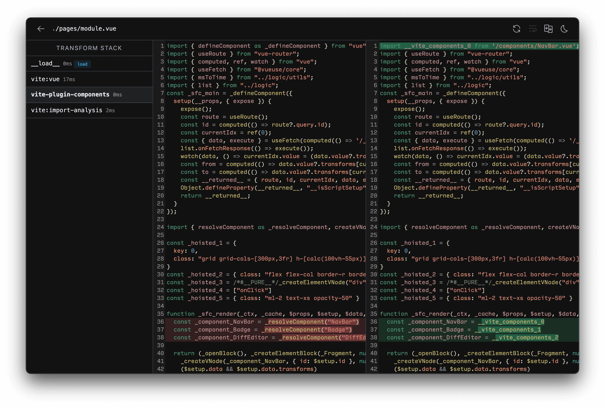

# Plugin API {#plugin-api}

Плагины Vite расширяют хорошо продуманный интерфейс плагинов Rollup несколькими дополнительными параметрами, специфичными для Vite. В результате вы можете написать плагин Vite один раз и использовать его как для разработки, так и для сборки.

**Рекомендуется сначала ознакомиться с [документацией по плагинам Rollup](https://rollupjs.org/plugin-development/), прежде чем читать разделы ниже.**

## Создание плагина {#authoring-a-plugin}

Vite стремится предлагать устоявшиеся паттерны из коробки, поэтому перед созданием нового плагина убедитесь, что вы проверили [Возможности](/guide/features), чтобы узнать, покрывает ли они ваши потребности. Также ознакомьтесь с доступными плагинами сообщества, как в виде [совместимого плагина Rollup](https://github.com/rollup/awesome), так и [специфичных для Vite плагинов](https://github.com/vitejs/awesome-vite#plugins).

При создании плагина вы можете встроить его в ваш `vite.config.js`. Нет необходимости создавать для него новый пакет. Как только вы увидите, что плагин был полезен в ваших проектах, подумайте о том, чтобы поделиться им для помощи другим [в экосистеме](https://chat.vite.dev).

::: tip
При обучении, отладке или написании плагинов мы рекомендуем включить [vite-plugin-inspect](https://github.com/antfu/vite-plugin-inspect) в ваш проект. Он позволяет вам просматривать промежуточное состояние плагинов Vite. После установки вы можете посетить `localhost:5173/__inspect/`, чтобы просмотреть модули и стек трансформаций вашего проекта. Ознакомьтесь с инструкциями по установке в [документации vite-plugin-inspect](https://github.com/antfu/vite-plugin-inspect).

:::

## Конвенции {#conventions}

Если плагин не использует специфические для Vite хуки и может быть реализован как [совместимый плагин Rollup](#rollup-plugin-compatibility), то рекомендуется использовать [конвенции именования плагинов Rollup](https://rollupjs.org/plugin-development/#conventions).

- Плагины Rollup должны иметь понятное имя с префиксом `rollup-plugin-`.
- Включите ключевые слова `rollup-plugin` и `vite-plugin` в package.json.

Это позволяет использовать плагин также в чистых проектах Rollup или на основе WMR.

Для плагинов только для Vite:

- Плагины Vite должны иметь понятное имя с префиксом `vite-plugin-`.
- Включите ключевое слово `vite-plugin` в package.json.
- Включите раздел в документации плагина, объясняющий, почему это плагин только для Vite (например, он использует специфические для Vite хуки плагинов).

Если ваш плагин будет работать только для определённого фреймворка, его имя должно быть включено в префикс:

- Префикс `vite-plugin-vue-` для плагинов Vue
- Префикс `vite-plugin-react-` для плагинов React
- Префикс `vite-plugin-svelte-` для плагинов Svelte

Смотрите также [Конвенция виртуальных модулей](#virtual-modules-convention).

## Конфигурация плагинов {#plugins-config}

Пользователи добавят плагины в `devDependencies` проекта и настроят их с помощью опции массива `plugins`:

```js
// vite.config.js
import vitePlugin from 'vite-plugin-feature'
import rollupPlugin from 'rollup-plugin-feature'

export default defineConfig({
  plugins: [vitePlugin(), rollupPlugin()],
})
```

Ложные плагины будут игнорироваться, что позволяет легко активировать или деактивировать плагины.

`plugins` также принимает пресеты, включающие несколько плагинов в качестве одного элемента. Это полезно для сложных функций (например, интеграции с фреймворками), которые реализованы с использованием нескольких плагинов. Массив будет внутренне уплощён.

```js
// framework-plugin
import frameworkRefresh from 'vite-plugin-framework-refresh'
import frameworkDevtools from 'vite-plugin-framework-devtools'

export default function framework(config) {
  return [frameworkRefresh(config), frameworkDevTools(config)]
}
```

```js
// vite.config.js
import { defineConfig } from 'vite'
import framework from 'vite-plugin-framework'

export default defineConfig({
  plugins: [framework()],
})
```

## Простые примеры {#simple-examples}

:::tip
Общепринятой конвенцией является создание плагина Vite/Rollup в виде фабричной функции, которая возвращает фактический объект плагина. Функция может принимать параметры, что позволяет пользователям настраивать поведение плагина.
:::

### Преобразование пользовательских типов файлов {#transforming-custom-file-types}

```js
const fileRegex = /\.(my-file-ext)$/

export default function myPlugin() {
  return {
    name: 'transform-file',

    transform(src, id) {
      if (fileRegex.test(id)) {
        return {
          code: compileFileToJS(src),
          map: null, // предоставьте карту источников, если она доступна
        }
      }
    },
  }
}
```

### Импорт виртуального файла {#importing-a-virtual-file}

Смотрите пример в [следующем разделе](#virtual-modules-convention).

## Конвенция виртуальных модулей {#virtual-modules-convention}

Виртуальные модули — это полезная схема, которая позволяет передавать информацию о времени сборки в исходные файлы, используя обычный синтаксис импорта ESM.

```js
export default function myPlugin() {
  const virtualModuleId = 'virtual:my-module'
  const resolvedVirtualModuleId = '\0' + virtualModuleId

  return {
    name: 'my-plugin', // обязательно, будет отображаться в предупреждениях и ошибках
    resolveId(id) {
      if (id === virtualModuleId) {
        return resolvedVirtualModuleId
      }
    },
    load(id) {
      if (id === resolvedVirtualModuleId) {
        return `export const msg = "from virtual module"`
      }
    },
  }
}
```

Что позволяет импортировать модуль в JavaScript:

```js
import { msg } from 'virtual:my-module'

console.log(msg)
```

Виртуальные модули в Vite (и Rollup) по соглашению имеют префикс `virtual:` для пользовательского пути. Если возможно, имя плагина должно использоваться в качестве пространства имён, чтобы избежать конфликтов с другими плагинами в экосистеме. Например, `vite-plugin-posts` может предложить пользователям импортировать виртуальные модули `virtual:posts` или `virtual:posts/helpers`, чтобы получить информацию о времени сборки. Внутри плагины, использующие виртуальные модули, должны префиксировать идентификатор модуля символом `\0` при разрешении идентификатора, что является соглашением из экосистемы Rollup. Это предотвращает попытки других плагинов обрабатывать идентификатор (например, разрешение узлов), и основные функции, такие как карты источников, могут использовать эту информацию для различения виртуальных модулей и обычных файлов. Символ `\0` не является допустимым символом в URL-адресах импорта, поэтому мы должны заменить его во время анализа импорта. Виртуальный идентификатор `\0{id}` в конечном итоге кодируется как `/@id/__x00__{id}` во время разработки в браузере. Идентификатор будет декодирован обратно перед входом в конвейер плагинов, поэтому это не видно коду хуков плагинов.

Обратите внимание, что модули, непосредственно производные от реального файла, как в случае скриптового модуля в компоненте единого файла (например, однофайловые компоненты .vue или .svelte), не обязаны следовать этому соглашению. SFC обычно генерируют набор подмодулей при обработке, но код в этих подмодулях может быть сопоставлен с файловой системой. Использование `\0` для этих подмодулей предотвратит корректную работу карт источников.

## Универсальные хуки {#universal-hooks}

Во время разработки сервер Vite создает контейнер плагинов, который вызывает [хуки сборки Rollup](https://rollupjs.org/plugin-development/#build-hooks) так же, как это делает Rollup.

Следующие хуки вызываются один раз при запуске сервера:

- [`options`](https://rollupjs.org/plugin-development/#options)
- [`buildStart`](https://rollupjs.org/plugin-development/#buildstart)

Следующие хуки вызываются при каждом входящем запросе модуля:

- [`resolveId`](https://rollupjs.org/plugin-development/#resolveid)
- [`load`](https://rollupjs.org/plugin-development/#load)
- [`transform`](https://rollupjs.org/plugin-development/#transform)

Эти хуки также имеют расширенный параметр `options` с дополнительными свойствами, специфичными для Vite. Вы можете прочитать больше в [документации по SSR](/guide/ssr#ssr-specific-plugin-logic).

Некоторые вызовы `resolveId` могут иметь значение `importer` в виде абсолютного пути к общему `index.html` в корне, так как не всегда возможно определить фактический импортёр из-за паттерна разработки без сборки пакета в сервере Vite. Для импортов, обрабатываемых в рамках разрешающего конвейера Vite, импортёр может отслеживаться на этапе анализа импорта, обеспечивая правильное значение `importer`.

Следующие хуки вызываются, когда сервер закрывается:

- [`buildEnd`](https://rollupjs.org/plugin-development/#buildend)
- [`closeBundle`](https://rollupjs.org/plugin-development/#closebundle)

Обратите внимание, что хук [`moduleParsed`](https://rollupjs.org/plugin-development/#moduleparsed) **не** вызывается во время разработки, поскольку Vite избегает полного разбора AST для повышения производительности.

[Хуки генерации вывода](https://rollupjs.org/plugin-development/#output-generation-hooks) (за исключением `closeBundle`) **не** вызываются во время разработки. Вы можете рассматривать dev-сервер Vite как вызывающий только `rollup.rollup()`, не вызывая `bundle.generate()`.

## Специфические хуки Vite {#vite-specific-hooks}

Плагины Vite также могут предоставлять хуки, которые служат специфическим для Vite целям. Эти хуки игнорируются Rollup.

### `config`

- **Тип:** `(config: UserConfig, env: { mode: string, command: string }) => UserConfig | null | void`
- **Вид:** `async`, `sequential`

  Измените конфигурацию Vite перед её разрешением. Хук получает необработанную пользовательскую конфигурацию (опции CLI, объединённые с файлом конфигурации) и текущую среду конфигурации, которая предоставляет используемые `mode` и `command`. Он может вернуть частичный объект конфигурации, который будет глубоко объединён с существующей конфигурацией, или напрямую изменить конфигурацию (если стандартное объединение не может достичь желаемого результата).

  **Пример:**

  ```js
  // возврат частичной конфигурации (рекомендуется)
  const partialConfigPlugin = () => ({
    name: 'return-partial',
    config: () => ({
      resolve: {
        alias: {
          foo: 'bar',
        },
      },
    }),
  })

  // прямое изменение конфигурации (используйте только когда объединение не работает)
  const mutateConfigPlugin = () => ({
    name: 'mutate-config',
    config(config, { command }) {
      if (command === 'build') {
        config.root = 'foo'
      }
    },
  })
  ```

  ::: warning
  Пользовательские плагины разрешаются перед выполнением этого хука, поэтому внедрение других плагинов внутри хука `config` не будет иметь эффекта.
  :::

### `configResolved`

- **Type:** `(config: ResolvedConfig) => void | Promise<void>`
- **Kind:** `async`, `parallel`

  Вызывается после разрешения конфигурации Vite. Используйте этот хук, чтобы прочитать и сохранить окончательную разрешённую конфигурацию. Он также полезен, когда плагин должен выполнять что-то другое в зависимости от выполняемой команды.

  **Пример:**

  ```js
  const examplePlugin = () => {
    let config

    return {
      name: 'read-config',

      configResolved(resolvedConfig) {
        // сохраняем разрешённую конфигурацию
        config = resolvedConfig
      },

      // используем сохранённую конфигурацию в других хуках
      transform(code, id) {
        if (config.command === 'serve') {
          // dev: плагин вызывается dev-сервером
        } else {
          // build: плагин вызывается Rollup
        }
      },
    }
  }
  ```

  Обратите внимание, что значение `command` равно `serve` в режиме разработки (в CLI `vite`, `vite dev` и `vite serve` являются псевдонимами).

### `configureServer`

- **Тип:** `(server: ViteDevServer) => (() => void) | void | Promise<(() => void) | void>`
- **Вид:** `async`, `sequential`
- **Смотрите также:** [ViteDevServer](./api-javascript#vitedevserver)

  Хук для настройки dev-сервера. Наиболее распространенный случай использования — добавление пользовательских промежуточных слоев к внутреннему [connect](https://github.com/senchalabs/connect) приложению:

  ```js
  const myPlugin = () => ({
    name: 'configure-server',
    configureServer(server) {
      server.middlewares.use((req, res, next) => {
        // пользовательская обработка запроса...
      })
    },
  })
  ```

  **Внедрение пост-промежуточного слоя**

  Хук `configureServer` вызывается до установки внутренних промежуточных слоев, поэтому пользовательские промежуточные слои будут выполняться до внутренних промежуточных слоев по умолчанию. Если вы хотите внедрить промежуточный слой **после** внутренних промежуточных слоев, вы можете вернуть функцию из `configureServer`, которая будет вызвана после установки внутренних промежуточных слоев:

  ```js
  const myPlugin = () => ({
    name: 'configure-server',
    configureServer(server) {
      // возвращаем пост-хук, который вызывается после установки внутренних промежуточных слоев
      return () => {
        server.middlewares.use((req, res, next) => {
          // пользовательская обработка запроса...
        })
      }
    },
  })
  ```

  **Хранение доступа к серверу**

  В некоторых случаях другие хуки плагинов могут нуждаться в доступе к экземпляру dev-сервера (например, для доступа к серверу веб-сокетов, наблюдателю за файловой системой или графу модулей). Этот хук также можно использовать для хранения экземпляра сервера для доступа в других хуках:

  ```js
  const myPlugin = () => {
    let server
    return {
      name: 'configure-server',
      configureServer(_server) {
        server = _server
      },
      transform(code, id) {
        if (server) {
          // используем сервер...
        }
      },
    }
  }
  ```

  Обратите внимание, что `configureServer` не вызывается при создании продакшен-сборки, поэтому ваши другие хуки должны учитывать его отсутствие.

### `configurePreviewServer`

- **Тип:** `(server: PreviewServer) => (() => void) | void | Promise<(() => void) | void>`
- **Вид:** `async`, `sequential`
- **Смотрите также:** [PreviewServer](./api-javascript#previewserver)

  То же самое, что и [`configureServer`](/guide/api-plugin.html#configureserver), но для сервера предварительного просмотра. Аналогично `configureServer`, хук `configurePreviewServer` вызывается до установки других промежуточных слоев. Если вы хотите внедрить промежуточный слой **после** других промежуточных слоев, вы можете вернуть функцию из `configurePreviewServer`, которая будет вызвана после установки внутренних промежуточных слоев:

  ```js
  const myPlugin = () => ({
    name: 'configure-preview-server',
    configurePreviewServer(server) {
      // возвращаем пост-хук, который вызывается после установки других промежуточных слоев
      return () => {
        server.middlewares.use((req, res, next) => {
          // пользовательская обработка запроса...
        })
      }
    },
  })
  ```

### `transformIndexHtml`

- **Тип:** `IndexHtmlTransformHook | { order?: 'pre' | 'post', handler: IndexHtmlTransformHook }`
- **Вид:** `async`, `sequential`

  Специальный хук для преобразования файлов HTML-точек входа, таких как `index.html`. Хук получает текущую строку HTML и контекст преобразования. Контекст предоставляет экземпляр [`ViteDevServer`](./api-javascript#vitedevserver) во время разработки и выводной пакет Rollup во время сборки.

  Хук может быть асинхронным и может возвращать одно из следующих значений:

  - Преобразованную строку HTML
  - Массив объектов-дескрипторов тегов (`{ tag, attrs, children }`), которые нужно вставить в существующий HTML. Каждый тег также может указывать, куда он должен быть вставлен (по умолчанию — добавление в `<head>`)
  - Объект, содержащий оба значения в виде `{ html, tags }`

  По умолчанию `order` равен `undefined`, и этот хук применяется после преобразования HTML. Чтобы вставить скрипт, который должен пройти через конвейер плагинов Vite, `order: 'pre'` применит хук до обработки HTML. `order: 'post'` применяет хук после того, как все хуки с `order`, равным `undefined`, были применены.

  **Простой пример:**

  ```js
  const htmlPlugin = () => {
    return {
      name: 'html-transform',
      transformIndexHtml(html) {
        return html.replace(
          /<title>(.*?)<\/title>/,
          `<title>Title replaced!</title>`,
        )
      },
    }
  }
  ```

  **Полная сигнатура хука:**

  ```ts
  type IndexHtmlTransformHook = (
    html: string,
    ctx: {
      path: string
      filename: string
      server?: ViteDevServer
      bundle?: import('rollup').OutputBundle
      chunk?: import('rollup').OutputChunk
    },
  ) =>
    | IndexHtmlTransformResult
    | void
    | Promise<IndexHtmlTransformResult | void>

  type IndexHtmlTransformResult =
    | string
    | HtmlTagDescriptor[]
    | {
        html: string
        tags: HtmlTagDescriptor[]
      }

  interface HtmlTagDescriptor {
    tag: string
    attrs?: Record<string, string | boolean>
    children?: string | HtmlTagDescriptor[]
    /**
     * по умолчанию: 'head-prepend'
     */
    injectTo?: 'head' | 'body' | 'head-prepend' | 'body-prepend'
  }
  ```

  ::: warning
  Этот хук не будет вызван, если вы используете фреймворк, который имеет собственную обработку файлов входа (например, [SvelteKit](https://github.com/sveltejs/kit/discussions/8269#discussioncomment-4509145)).
  :::

### `handleHotUpdate`

- **Тип:** `(ctx: HmrContext) => Array<ModuleNode> | void | Promise<Array<ModuleNode> | void>`
- **Смотрите также:** [HMR API](./api-hmr)

  Выполняет пользовательскую обработку обновлений HMR. Хук получает объект контекста со следующей сигнатурой:

  ```ts
  interface HmrContext {
    file: string
    timestamp: number
    modules: Array<ModuleNode>
    read: () => string | Promise<string>
    server: ViteDevServer
  }
  ```

  - `modules` — это массив модулей, на которые повлиял изменённый файл. Это массив, потому что один файл может соответствовать нескольким обслуживаемым модулям (например, Vue SFC).

  - `read` — это асинхронная функция чтения, которая возвращает содержимое файла. Это предоставляется, потому что в некоторых системах обратный вызов изменения файла может срабатывать слишком быстро, прежде чем редактор завершит обновление файла, и прямой вызов `fs.readFile` вернет пустое содержимое. Функция чтения, переданная в хук, нормализует это поведение.

  Хук может выбрать:

  - Отфильтровать и уточнить список затронутых модулей, чтобы HMR был более точным.

  - Вернуть пустой массив и выполнить полную перезагрузку:

    ```js
    handleHotUpdate({ server, modules, timestamp }) {
      // Ручное аннулирование модулей
      const invalidatedModules = new Set()
      for (const mod of modules) {
        server.moduleGraph.invalidateModule(
          mod,
          invalidatedModules,
          timestamp,
          true
        )
      }
      server.ws.send({ type: 'full-reload' })
      return []
    }
    ```

  - Вернуть пустой массив и выполнить полную пользовательскую обработку HMR, отправляя пользовательские события клиенту:

    ```js
    handleHotUpdate({ server }) {
      server.ws.send({
        type: 'custom',
        event: 'special-update',
        data: {}
      })
      return []
    }
    ```

    Код клиента должен зарегистрировать соответствующий обработчик, используя [HMR API](./api-hmr) (это может быть внедрено через хук `transform` того же плагина):

    ```js
    if (import.meta.hot) {
      import.meta.hot.on('special-update', (data) => {
        // выполняем пользовательское обновление
      })
    }
    ```

## Порядок плагинов {#plugin-ordering}

Плагин Vite может дополнительно указать свойство `enforce` (аналогично загрузчикам webpack), чтобы настроить порядок его применения. Значение `enforce` может быть либо `"pre"`, либо `"post"`. Разрешённые плагины будут выполняться в следующем порядке:

- Псевдонимы
- Пользовательские плагины с `enforce: 'pre'`
- Ядро плагинов Vite
- Пользовательские плагины без значения enforce
- Плагины сборки Vite
- Пользовательские плагины с `enforce: 'post'`
- Постсборочные плагины Vite (минификация, манифест, отчетность)

Обратите внимание, что это работает отдельно от порядка хуков, которые по-прежнему подлежат своему атрибуту `order` [как обычно для хуков Rollup](https://rollupjs.org/plugin-development/#build-hooks).

## Применение по условию {#conditional-application}

По умолчанию плагины вызываются как для сервера, так и для сборки. В случаях, когда плагин необходимо применять условно только во время сервера или сборки, используйте свойство `apply`, чтобы вызывать их только во время `'build'` или `'serve'`:

```js
function myPlugin() {
  return {
    name: 'build-only',
    apply: 'build', // или 'serve'
  }
}
```

Функция также может быть использована для более точного контроля:

```js
apply(config, { command }) {
  // применяем только при сборке, но не для SSR
  return command === 'build' && !config.build.ssr
}
```

## Совместимость плагинов Rollup {#rollup-plugin-compatibility}

Достаточное количество плагинов Rollup будет работать напрямую как плагины Vite (например, `@rollup/plugin-alias` или `@rollup/plugin-json`), но не все из них, так как некоторые хуки плагинов не имеют смысла в контексте dev-сервера без сборки пакета.

В общем, если плагин Rollup соответствует следующим критериям, он должен работать как плагин Vite:

- Он не использует хук [`moduleParsed`](https://rollupjs.org/plugin-development/#moduleparsed).
- У него нет сильной связи между хуками фазы сборки и хуками фазы вывода.

Если плагин Rollup имеет смысл только для фазы сборки, его можно указать в `build.rollupOptions.plugins`. Он будет работать так же, как плагин Vite с `enforce: 'post'` и `apply: 'build'`.

Вы также можете дополнить существующий плагин Rollup свойствами, специфичными для Vite:

```js
// vite.config.js
import example from 'rollup-plugin-example'
import { defineConfig } from 'vite'

export default defineConfig({
  plugins: [
    {
      ...example(),
      enforce: 'post',
      apply: 'build',
    },
  ],
})
```

## Нормализация путей {#path-normalization}

Vite нормализует пути при разрешении идентификаторов, используя разделители POSIX ( / ), сохраняя при этом объём в Windows. С другой стороны, Rollup по умолчанию оставляет разрешённые пути нетронутыми, поэтому разрешённые идентификаторы имеют разделители win32 ( \\ ) в Windows. Однако плагины Rollup используют внутреннюю функцию утилиты [`normalizePath`](https://github.com/rollup/plugins/tree/master/packages/pluginutils#normalizepath) из `@rollup/pluginutils`, которая преобразует разделители в POSIX перед выполнением сравнений. Это означает, что когда эти плагины используются в Vite, шаблоны конфигурации `include` и `exclude`, а также другие аналогичные пути для сравнений разрешённых идентификаторов работают корректно.

Таким образом, для плагинов Vite, при сравнении путей с разрешёнными идентификаторами важно сначала нормализовать пути, чтобы использовать разделители POSIX. Эквивалентная функция утилиты `normalizePath` экспортируется из модуля `vite`.

```js
import { normalizePath } from 'vite'

normalizePath('foo\\bar') // 'foo/bar'
normalizePath('foo/bar') // 'foo/bar'
```

## Фильтрация, шаблон include/exclude {#filtering-include-exclude-pattern}

Vite предоставляет функцию [`createFilter`](https://github.com/rollup/plugins/tree/master/packages/pluginutils#createfilter) из `@rollup/pluginutils`, чтобы побудить специфичные для Vite плагины и интеграции использовать стандартный шаблон фильтрации include/exclude, который также используется в Vite Core.

## Связь клиент-сервер {#client-server-communication}

Начиная с Vite 2.9, мы предоставляем некоторые утилиты для плагинов, чтобы помочь в обработке связи с клиентами.

### От сервера к клиенту {#server-to-client}

На стороне плагина мы можем использовать `server.ws.send`, чтобы транслировать события клиенту:

```js
// vite.config.js
export default defineConfig({
  plugins: [
    {
      // ...
      configureServer(server) {
        server.ws.on('connection', () => {
          server.ws.send('my:greetings', { msg: 'привет' })
        })
      },
    },
  ],
})
```

::: tip ПРИМЕЧАНИЕ
Мы рекомендуем **всегда добавлять префикс** к именам ваших событий, чтобы избежать конфликтов с другими плагинами.
:::

На стороне клиента используйте [`hot.on`](/guide/api-hmr.html#hot-on-event-cb), чтобы слушать события:

```ts twoslash
import 'vite/client'
// ---cut---
// сторона клиента
if (import.meta.hot) {
  import.meta.hot.on('my:greetings', (data) => {
    console.log(data.msg) // привет
  })
}
```

### От клиента к серверу {#client-to-server}

Чтобы отправить события от клиента к серверу, мы можем использовать [`hot.send`](/guide/api-hmr.html#hot-send-event-payload):

```ts
// сторона клиента
if (import.meta.hot) {
  import.meta.hot.send('my:from-client', { msg: 'Привет!' })
}
```

Затем используйте `server.ws.on` и слушайте события на стороне сервера:

```js
// vite.config.js
export default defineConfig({
  plugins: [
    {
      // ...
      configureServer(server) {
        server.ws.on('my:from-client', (data, client) => {
          console.log('Сообщение от клиента:', data.msg) // Привет!
          // отвечаем только клиенту (если необходимо)
          client.send('my:ack', { msg: 'Привет! Я получил ваше сообщение!' })
        })
      },
    },
  ],
})
```

### TypeScript для пользовательских событий {#typescript-for-custom-events}

Возможно типизировать пользовательские события, расширяя интерфейс `CustomEventMap`:

```ts
// events.d.ts
import 'vite/types/customEvent'

declare module 'vite/types/customEvent' {
  interface CustomEventMap {
    'custom:foo': { msg: string }
    // 'event-key': payload
  }
}
```
